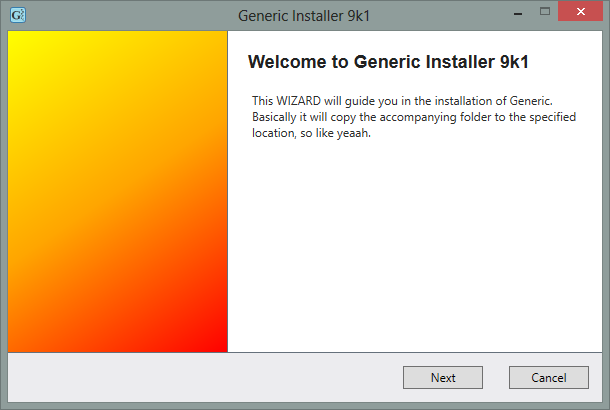
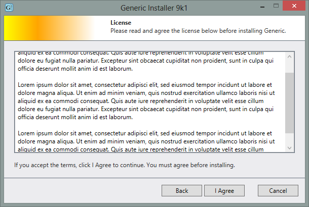
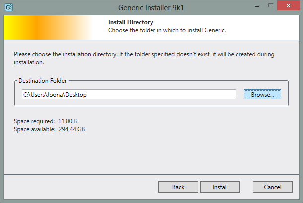
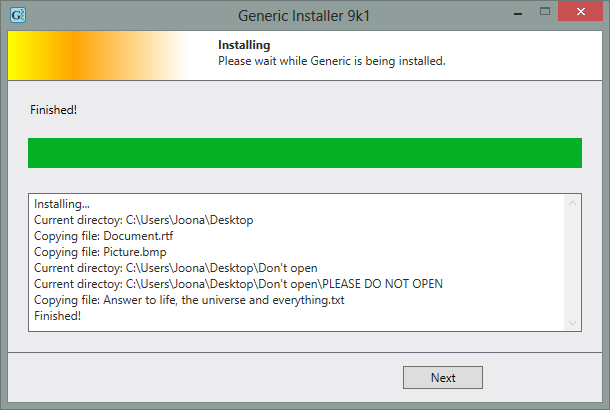
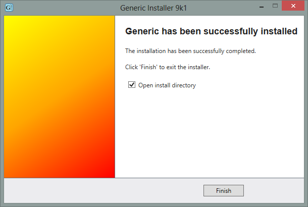

# Basic installer using C# and .NET

Project I made as a part of a recruitment process during <b>may 2014</b>. Basically it just copies the files provided with the program to the folder the user specified.  
During the building of the program I learned how to utilise the <b>MVP pattern</b> in practice. I also acquainted myself with the <b>WPF</b> of the <b>.NET Framework</b>.

 
 
 
 

